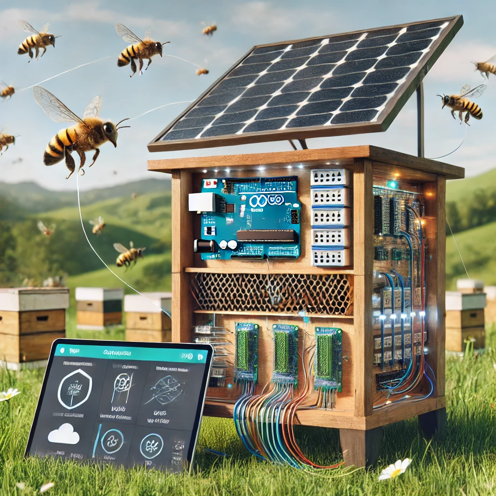

# Arduino-MKR-Ruche

## Table des matières

- [Introduction](#introduction)
- [Fonctionnalités](#fonctionnalités)
- [Mise en service](#mise-en-service)

## Introduction

Ce projet vise à développer un système de surveillance de ruche innovant, utilisant une carte Arduino MKR WAN 1310 pour collecter des données environnementales directement dans la ruche, une passerelle SenseCAP M2 pour la transmission via LoRaWAN, et une Raspberry Pi pour l'analyse et la visualisation des données. L'objectif est d'améliorer la santé et la productivité des colonies d'abeilles grâce à une gestion éclairée et en temps réel ainsi qu'une prévention plus accrue grâce aux différentes grandeurs mesurées.

Sur cette page github, vous retrouverez tous les fichiers nécessaires au bon fonctionnement de la carte Arduino MKR WAN 1310 et de ses capteurs à placer dans la ruche pour la collecte et l'envoi de données.
Vous retrouverez également des fichiers de schémas et de circuits électroniques qui peuvent vous servir à vous exercez sur du matériel virtuel avant de passer sur le matériel en lui-même.

## Fonctionnalités

- Surveillance de la température, de l'humidité et du poids de la ruche.
- Transmission des données via LoRaWAN.
- Analyse et visualisation sur Raspberry Pi.
- Interface utilisateur intuitive pour les apiculteurs et les débutants en informatique.
- Mise en place du matériel simple grâce aux différents guides fournis avec le projet.

## Technologies utilisées

- Arduino MKR WAN 1310
- Raspberry Pi
- Passerelle LoraWAN SenseCAP M2
- Réseau LoraWAN

## Mise en Service
